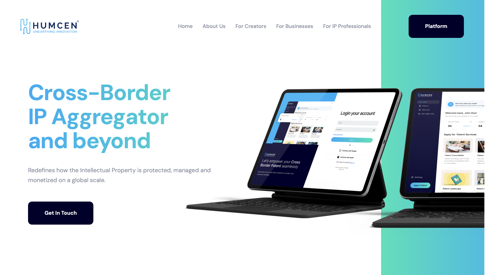
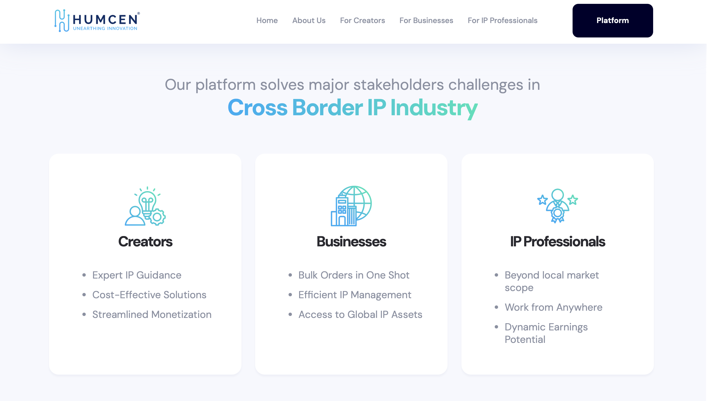
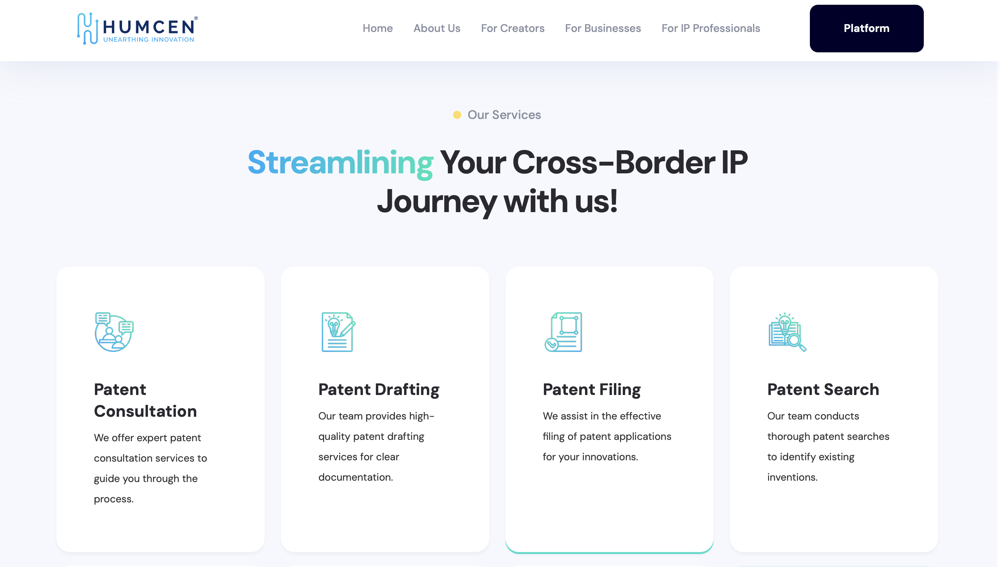

# Humcen CrossBorder IP - Global IP Aggregator Platform

## Description
Humcen CrossBorder IP is an innovative IP aggregator platform designed to streamline the process of applying for patents anywhere in the world. Our platform enhances the IP application experience for both IP professionals and customers, ensuring efficient and effective global patent management.

## Project Live Link🌱
[Insert your project's live link here]

## Key Features

- **Intuitive and User-Friendly**: Enjoy a sleek, easy-to-navigate interface that simplifies the IP application process for both professionals and clients. With a clean design and straightforward functionality, managing global IP rights has never been easier.
  
  

- **Global IP Application Tracking**: Streamline the patent application process with automated tracking and filtering across multiple jurisdictions, saving you time and effort.
  
  

- **Engaging Client Experience**: Provide a seamless and positive client experience with personalized communication and easy-to-use tools for managing IP portfolios.
  
  

- **Data-Driven Insights**: Gain valuable insights into your IP portfolio and application processes with detailed analytics and reporting, helping you make informed decisions.
  
  

- **AI-Assisted Patent Filing**: Our intelligent AI assistant helps IP professionals fill forms automatically with prompts based on different patent types and jurisdictions, reducing manual data entry and ensuring accuracy.

- **Cross-Border Collaboration**: Facilitate seamless collaboration between IP professionals across different countries, ensuring smooth handling of international patent applications.

## Installation

To install the project, clone the repository:

```bash
git clone https://github.com/sriramsenthill/trance.git
```
## Setting Up Your MERN Stack Project: Trance

### Prerequisites
Before we begin, ensure you have the following installed:

- **Node.js and npm**: Download and install the latest version from [nodejs.org](https://nodejs.org/en). Note that npm (Node Package Manager) is included with Node.js installation and is essential for managing project dependencies.
  
- **Git**: Download and install Git from [git-scm.com](https://git-scm.com/downloads). Git is necessary for version control and cloning the project repository.

- **A Code Editor**: We recommend Visual Studio Code, but you can use any editor of your choice that supports JavaScript development.

- **A Terminal or Command Prompt**: This is where you'll execute most of the commands during setup and development.

### 1. Create a New Project Directory
Open your terminal and navigate to the desired location for your project:
```bash
mkdir humcen-project
cd humcen-project
```

### 2. Clone the Project from GitHub
Clone the project repository using Git:
```bash
git clone https://github.com/sriramsenthill/trance.git
```

### 3. Install Dependencies
Install the necessary dependencies for your MERN stack project:
1. Open the `client` directory:
   ```bash
   cd trance-project/trance/client
   ```
3. Run this command to install dependencies:
   ```bash
   npm i --legacy-peer-deps
   ```
4. Once the installation is complete, go to the `server` directory:
   ```bash
   cd trance-project/trance/server
   ```
5. Run the command to install client dependencies:
   ```bash
   npm i
   ```
6. Install `bcryptjs` for password hashing:
   ```bash
   npm install bcryptjs
   ```

### 4. Start the Development Server
1. Go back to the `Server` directory and run:
   ```bash
   npm run dev
   ```
2. Open another terminal window, navigate to the `client` directory again, and run:
   ```bash
   npm run dev
   ```

This should start both the client and server on your local host at ports 3000 (server) and 3001 (client).

---

With these steps completed, you should have the Humcen CrossBorder IP project up and running on your local machine. Happy developing!
